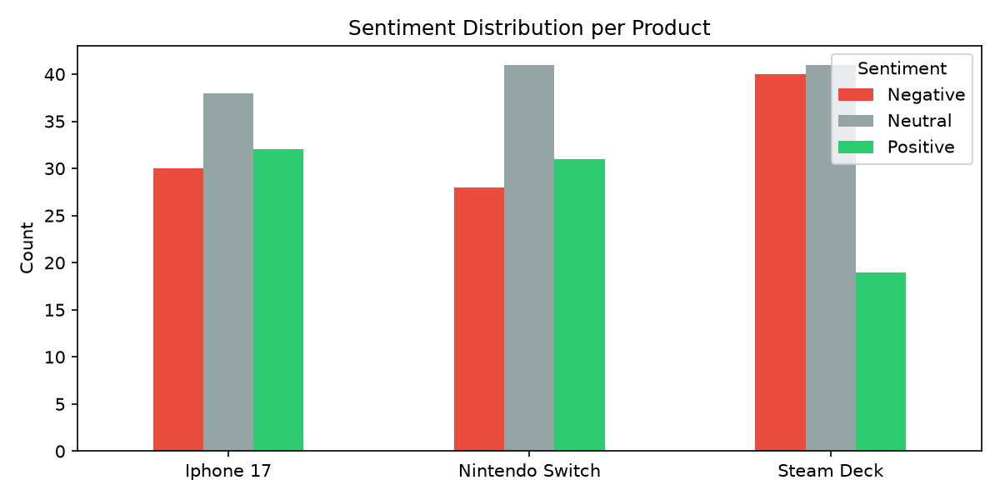
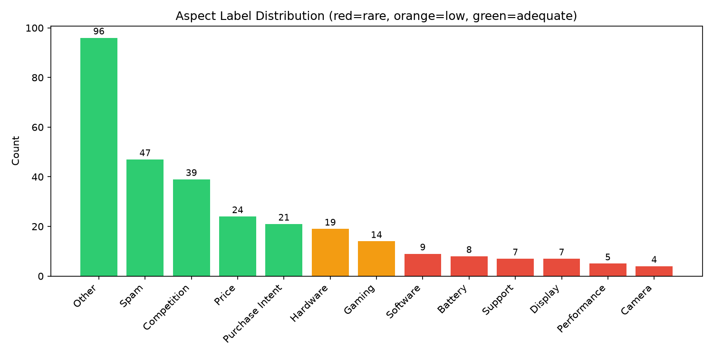
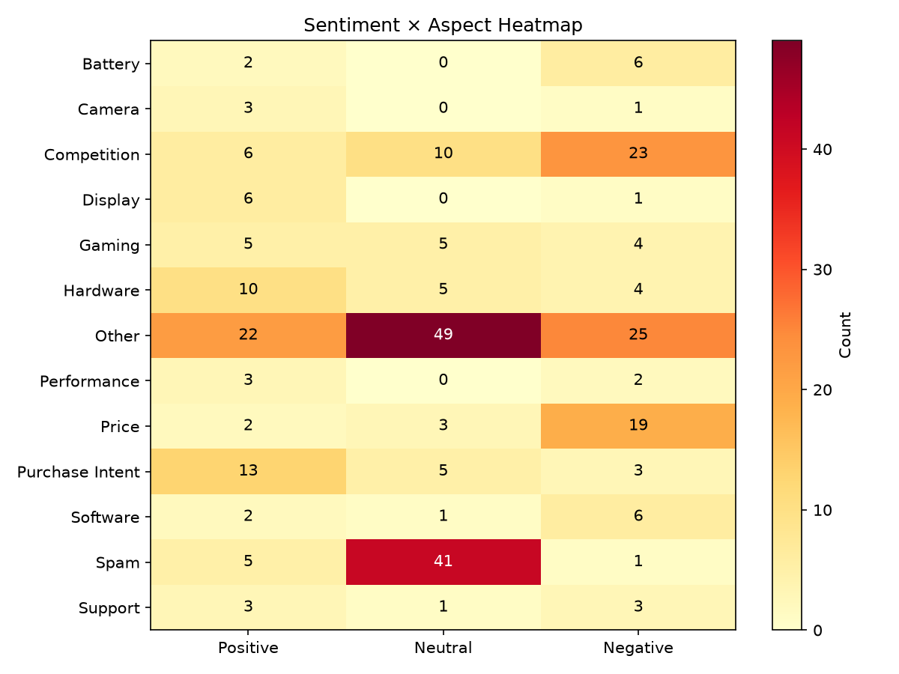

<div align="center">
  <h1>ReviewRadar</h1>
  <strong>Consumer Intelligence Platform — NLP-Driven Sentiment & Aspect Mining from YouTube Product Reviews</strong>
  <br>
  <a href="https://review-radar-dashboard.streamlit.app">https://review-radar-dashboard.streamlit.app</a>
</div>

<br>

<p align="center">
  <a href="https://review-radar-dashboard.streamlit.app">
    
  </a>
  <a href="LICENSE">
    
  </a>
  
  
  
  
</p>

---

## Table of Contents

- [What is ReviewRadar?](#what-is-reviewradar)
- [Pipeline Architecture](#pipeline-architecture)
- [Key Features](#key-features)
- [Model Performance](#model-performance)
- [Tech Stack](#tech-stack)
- [Getting Started](#getting-started)
- [Live Demo](#live-demo)
- [Screenshots](#screenshots)
- [Project Structure](#project-structure)
- [Contributing](#contributing)
- [License](#license)

---

## What is ReviewRadar?

ReviewRadar is an end-to-end **NLP pipeline** that transforms raw YouTube review comments into structured consumer intelligence. It fine-tunes **DistilBERT** for multi-class sentiment classification and aspect detection across 13 product categories, uses **BERTopic** for unsupervised theme discovery, and surfaces everything through an interactive **Streamlit** dashboard.

Unlike off-the-shelf sentiment APIs, ReviewRadar is built for the product review domain — it handles **Hinglish** (Hindi-English code-mixed text), detects spam, performs language-aware translation, and provides per-aspect breakdowns so you know exactly what users are saying about battery life, camera quality, performance, and more.

### Why ReviewRadar?

| Problem | Solution |
|---|---|
| Manual review analysis doesn't scale | Automated NLP pipeline ingests hundreds of comments per product |
| Generic sentiment misses product-specific context | Fine-tuned DistilBERT trained on 300+ annotated review comments |
| You don't know *what* users love or hate | 13-class aspect classification pinpoints Battery, Camera, Display, etc. |
| Review data is noisy (spam, short comments, mixed languages) | Multi-stage preprocessing with spam filtering, Hinglish normalization, and translation |
| Static reports become stale quickly | Interactive Streamlit dashboard with real-time pipeline execution |

---

## Pipeline Architecture

```
                      ┌──────────────────┐
                      │  Product Name     │
                      │  (e.g. "iPhone    │
                      │   17", "Steam     │
                      │   Deck")          │
                      └────────┬─────────┘
                               │
                               ▼
               ┌───────────────────────────────┐
               │   YouTube Data API v3         │
               │   • Search review videos      │
               │   • Fetch metadata (views,    │
               │     likes, duration, tags)    │
               │   • Extract top-level         │
               │     comments (up to 100/vid)  │
               └───────────────┬───────────────┘
                               │
                               ▼
               ┌───────────────────────────────┐
               │   Preprocessing Pipeline      │
               │   • Text cleaning             │
               │   • Spam detection            │
               │   • Short comment removal     │
               │   • Hinglish normalization    │
               │   • Language detection        │
               │   • Translation → English     │
               └───────────────┬───────────────┘
                               │
                               ▼
          ┌─────────────────────────────────────┐
          │         Feature Pipeline            │
          │  ┌─────────────┐  ┌──────────────┐  │
          │  │  DistilBERT │  │  DistilBERT  │  │
          │  │ Sentiment   │  │  Aspect      │  │
          │  │ (3-class)   │  │  (13-class)  │  │
          │  └─────────────┘  └──────────────┘  │
          │         +                            │
          │  ┌─────────────┐                     │
          │  │  BERTopic   │                     │
          │  │  Topic      │                     │
          │  │  Modeling   │                     │
          │  └─────────────┘                     │
          │         +                            │
          │  ┌─────────────┐                     │
          │  │ Competitor  │                     │
          │  │ Detection   │                     │
          │  └─────────────┘                     │
          └───────────────┬─────────────────────┘
                          │
                          ▼
          ┌─────────────────────────────────────┐
          │       Insight Report Generator      │
          │   • Sentiment distribution          │
          │   • Aspect breakdown                │
          │   • Top comments by likes           │
          │   • Competitor mentions             │
          └───────────────┬─────────────────────┘
                          │
                          ▼
          ┌─────────────────────────────────────┐
          │    Streamlit Dashboard             │
          │  ┌──────────┬──────────┬──────────┐ │
          │  │ Product  │  Model   │ Dataset  │ │
          │  │ Overview │Transp.   │  Stats   │ │
          │  └──────────┴──────────┴──────────┘ │
          │         ┌──────────┐                │
          │         │   Run    │                │
          │         │ Pipeline │                │
          │         └──────────┘                │
          └─────────────────────────────────────┘
```

---

## Key Features

### YouTube Data Collection
- Searches YouTube for product review videos using the Data API v3
- Extracts video metadata (views, likes, duration, tags, channel)
- Retrieves top-level comments with engagement metrics

### Multi-Stage Text Preprocessing
- **Spam Detection** — Filters promotional and low-quality comments
- **Hinglish Normalization** — Handles Hindi-English code-mixed text common in Indian reviews
- **Language Detection & Translation** — Detects non-English comments and translates them via a pipeline
- **Short Comment Removal** — Filters out uninformative one-word or empty comments

### Sentiment Classification
- **Rule-Based Scorer** — Keyword lexicon with negation and intensifier handling
- **VADER** — NLTK-based sentiment intensity analyzer
- **RoBERTa** — Pretrained Twitter-RoBERTa sentiment model (cardiffnlp)
- **DistilBERT (fine-tuned)** — Custom 3-class classifier (Positive / Neutral / Negative) trained on 300+ human-annotated product review comments with weighted loss and 5-fold cross-validation

### Aspect Classification
- **DistilBERT (fine-tuned)** — 13-class classifier identifying which product dimension a comment discusses
- Labels: *Battery, Camera, Competition, Display, Gaming, Hardware, Other, Performance, Price, Purchase Intent, Software, Spam, Support*
- Trained on 897 balanced samples (69 per class) using oversampling

### Unsupervised Topic Modeling
- **BERTopic** — Discovers latent themes across the comment corpus without predefined categories
- Complements the supervised aspect model with emergent topic detection

### Competitor Detection
- Keyword-based competitor mention extraction
- Product-specific keyword lists with a fallback default dictionary
- Surfaces which competing products users are comparing against

### Interactive Dashboard (Streamlit)
- **Product Overview** — Sentiment distribution, competitor mentions, sample comments with like-weighted filtering
- **Model Transparency** — Per-class precision/recall/F1, confusion matrices, accuracy comparison across scorers
- **Dataset Stats** — Language distribution, per-product breakdown, annotation dataset statistics
- **Run Pipeline** — Enter a product name, execute the full pipeline, and view results immediately

### Evaluation & Annotation
- **Manual Annotation Support** — Sample generation, statistics, and guidelines for human-labeled data
- **Pseudolabeling & Self-Training** — Iterative model improvement using model predictions as weak labels
- **Comprehensive Metrics** — Confusion matrices, per-class F1/precision/recall, accuracy, macro averages

---

## Model Performance

### Sentiment Classification (DistilBERT fine-tuned)

| Metric | Value |
|---|---|
| Accuracy | ~60% (5-fold CV) |
| Architecture | DistilBERT + 3-class head |
| Training Data | 300+ human-annotated comments |
| Sampling | Like-weighted (prioritizes high-engagement comments) |
| Loss Function | Weighted CrossEntropy (class-balanced) |

### Aspect Classification (DistilBERT fine-tuned)

| Metric | Value |
|---|---|
| Accuracy | Evaluated on held-out test set |
| Classes | 13 product aspects |
| Training Data | 897 balanced samples (69/class) |
| Sampling | Oversampled to handle class imbalance |
| Architecture | DistilBERT + 13-class head |

---

## Tech Stack

<p align="center">
  
  
  
  
  
  
  
  
  
  
  
  
</p>

| Layer | Technology |
|---|---|
| **Language** | Python 3.11+ |
| **Deep Learning** | PyTorch, HuggingFace Transformers |
| **Models** | DistilBERT (sentiment + aspect), BERTopic |
| **Dashboard** | Streamlit, Plotly |
| **Data Processing** | pandas, NumPy, scikit-learn, NLTK |
| **Data Source** | YouTube Data API v3 |
| **Storage** | Parquet, CSV, JSON |
| **Testing** | pytest |

---

## Getting Started

### Prerequisites

- Python 3.11 or higher
- A [YouTube Data API v3 key](https://console.cloud.google.com/apis/credentials) (free tier available)

### Setup

```bash
# Clone the repository
git clone https://github.com/hiteshkoli0310/Review-radar.git
cd Review-radar

# Create and activate a virtual environment
python -m venv .venv
source .venv/bin/activate        # Linux/macOS
# .venv\Scripts\Activate.ps1     # Windows

# Install dependencies (development mode)
pip install -e .

# Or for a lightweight install
pip install -r requirements.txt
```

### Configuration

Copy `.env.example` to `.env` and add your YouTube API key:

```
YOUTUBE_API_KEY=your_api_key_here
YOUTUBE_API_SERVICE_NAME=youtube
YOUTUBE_API_VERSION=v3
REVIEWRADAR_DATA_DIR=data
REVIEWRADAR_LOG_LEVEL=INFO
REVIEWRADAR_STREAMLIT_PORT=8501
```

### Running the Dashboard

```bash
python run_dashboard.py
```

Opens at [http://localhost:8501](http://localhost:8501).

### Running the Pipeline (CLI)

```bash
python run_pipeline.py
```

You will be prompted for a product name (e.g., `iPhone 17`). The pipeline will search YouTube, extract comments, run all models, and save the results.

### Running Tests

```bash
pytest
```

---

## Live Demo

Try the deployed application:

[**https://review-radar-dashboard.streamlit.app**](https://review-radar-dashboard.streamlit.app)

The demo includes pre-computed insights for several products. You can also run the full pipeline on any product directly from the dashboard.

---

## Screenshots


*Product Overview tab — sentiment distribution across analyzed products*


*Aspect classification distribution — which product dimensions users discuss most*


*Model Transparency tab — confusion matrix and per-class performance metrics*

---

## Project Structure

```
Review-radar/
├── run_dashboard.py              # Launch the Streamlit dashboard
├── run_pipeline.py               # Run the data collection pipeline from CLI
├── pyproject.toml                # Build configuration & dependencies
├── requirements.txt              # Pinned dependencies
├── .env                          # API keys & config (not committed)
│
├── src/reviewradar/
│   ├── data_collection/          # YouTube search, metadata, comment extraction
│   ├── preprocessing/            # Cleaning, spam detection, text normalization
│   ├── translation/              # Hinglish normalization, translation pipeline
│   ├── models/                   # Sentiment, aspect, topic modeling interfaces
│   ├── evaluation/               # Sentiment & aspect evaluation, insight reports
│   ├── app/                      # Streamlit dashboard & pipeline orchestrator
│   ├── pipelines/                # End-to-end pipeline orchestration
│   ├── annotation/               # Dataset annotation, sample generation, self-training
│   ├── data_audit/               # Language detection & auditing
│   ├── data_validation/          # Dataset profiling & validation
│   ├── dataset_export/           # Master dataset builder & export
│   ├── eda/                      # Exploratory data analysis helpers
│   ├── config/                   # Paths, environment, centralized settings
│   ├── visualization/            # Reusable Plotly chart builders
│   └── utils/                    # Logging, I/O, shared utilities
│
├── data/
│   ├── raw/                      # Immutable API pulls
│   ├── interim/                  # Transitional cleaned data
│   ├── processed/                # Analysis-ready datasets (Parquet)
│   ├── models/                   # Serialized model artifacts
│   ├── reports/                  # Evaluation reports, insight JSONs, charts
│   └── annotation/               # Annotation samples & guidelines
│
├── models/                       # Trained DistilBERT checkpoints
├── notebooks/                    # EDA and experimentation
└── tests/                        # pytest test suite
```

---

## Contributing

Contributions are welcome — whether it's training better models, adding new preprocessing techniques, improving the dashboard, or expanding the annotation dataset.

1. Fork the Project
2. Create your Feature Branch (`git checkout -b feature/AmazingFeature`)
3. Commit your Changes (`git commit -m 'Add AmazingFeature'`)
4. Push to the Branch (`git push origin feature/AmazingFeature`)
5. Open a Pull Request

---

## License

This project is licensed under the MIT License. See [LICENSE](LICENSE) for details.

---

<p align="center">
  <em>ReviewRadar — turning raw YouTube comments into actionable product intelligence</em>
</p>

<p align="center">
  <a href="#table-of-contents">Back to Top</a>
</p>
